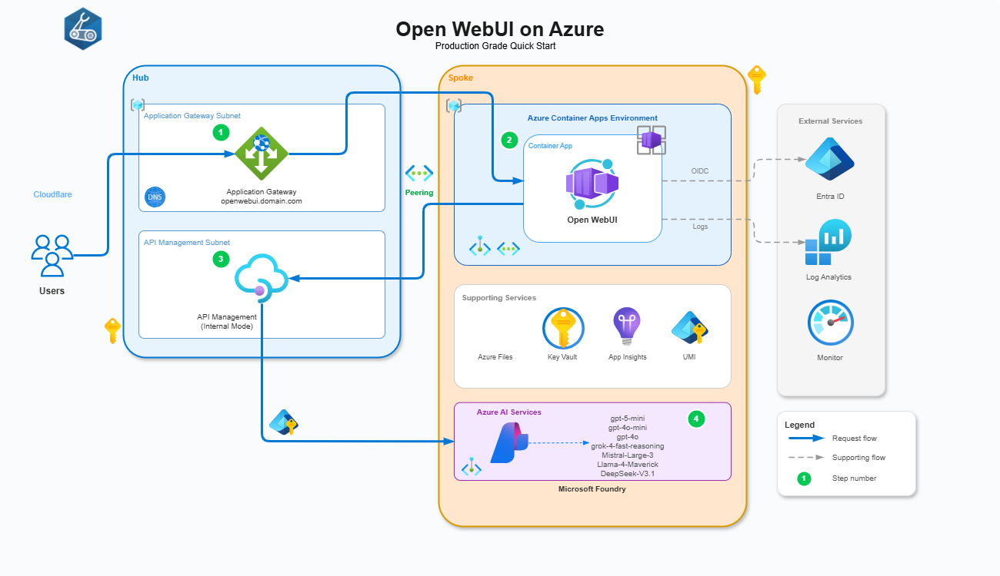

# Open WebUI on Azure - Production Grade Quickstart

Deploy [Open WebUI](https://github.com/open-webui/open-webui) on Azure Container Apps with Entra ID authentication, Azure API Management (AI API Gateway), Microsoft (Azure) Foundry integration, and Application Gateway.

## Architecture




## Features

✅ **Open WebUI** on Azure Container Apps with native OAuth/OIDC Entra ID integration  
✅ **Microsoft Foundry** with multiple models (GPT, Grok, Mistral, Llama, DeepSeek) using Managed Identity  
✅ **Application Gateway** with custom domain and SSL termination  
✅ **API Management with AI in Azure** with token tracking, limits, usage metrics, custom analytics, Entra OAuth policy validation enforcement  
✅ **Azure PostgreSQL Database** for persistent storage (users, chats, settings) with private endpoint access  
✅ **No secrets!** Managed Identity + OIDC throughout*  
✅ **Infrastructure as Code** using Bicep with Azure Verified Modules  
✅ **Secure by default** using internal ingresses and private endpoints

> [!NOTE]
>
> - *Azure Container Apps still [requires Storage Account Access Keys for Azure File SMB mount](https://learn.microsoft.com/en-us/azure/container-apps/storage-mounts-azure-files?tabs=bash#set-up-a-storage-account) :(
> - **Open WebUI does not support Entra authentication for PostgreSQL yet.

## Prerequisites

- Azure subscription(s) Owner access with Azure CLI and Bicep installed
- Custom domain with DNS provider (Cloudflare used in examples)
- SSL certificate (Cloudflare Origin Certificate for Full strict SSL mode and custom domain on ACA env)
- Application Developer Role (Entra)

## Deployment

### Quick Start

This project uses a **shared configuration file** to simplify deployment. Most values only need to be set once.

> [!IMPORTANT]
> **Before deploying, update the shared configuration file:**
>
> **`infra/bicep/shared/config.bicep`** - Single source of truth for all configuration:
>
> | Setting | Description | Example |
> |---------|-------------|---------|
> | `location` | Azure region | `uksouth` |
> | `customDomain` | Your custom domain | `openwebui.example.com` |
> | `apimPublisherEmail` | Your email (required) | `admin@example.com` |
> | `apimPublisherName` | Your name | `Your Name` |
> | `tags.Owner` | Resource owner | `Your Name` |
>
> All other values (resource names, network CIDRs, SKUs) have sensible defaults.

### Certificate Setup

Before deploying, place your Cloudflare Origin CA certificate in the cert folder:

1. Download your Cloudflare Origin CA certificate (PEM format)
2. Save it as `infra/bicep/cert/cloudflare-origin-ca.cer`

See [infra/bicep/cert/README.md](infra/bicep/cert/README.md) for detailed instructions.

---

### Step 1: Deploy Hub Infrastructure

Deploy the hub to create networking, DNS zones, APIM, and Application Gateway:

```bash
az deployment sub create \
  --location uksouth \
  --template-file infra/bicep/main.bicep \
  --parameters infra/bicep/main.bicepparam
```

> [!NOTE]
> The first deployment uses placeholder values for Container App outputs. This is handled gracefully - APIM and networking are created, but spoke-dependent configurations are skipped.

**Check the deployment summary output** (`outDeploymentSummary`):

```json
{
  "deploymentType": "Initial Hub (Step 1)",
  "nextSteps": [
    "1. Deploy app.bicep (Step 2) to create spoke infrastructure",
    "2. Note the outputs: outContainerAppFqdn, outContainerAppEnvStaticIp, outOpenWebUIAppId",
    "3. Grant admin consent in Entra ID for app-open-webui",
    "4. Update main.bicepparam with spoke outputs and set parConfigureFoundry=true",
    "5. Redeploy main.bicep (Step 3)"
  ]
}
```

---

### Step 2: Deploy App Infrastructure (Spoke)

Create the PFX certificate and deploy the spoke:

**Linux/macOS:**

```bash
# Create passwordless PFX and base64 encode it
openssl pkcs12 -export -out cloudflare-origin.pfx -inkey origin.key -in origin.pem -password pass:
base64 -w0 cloudflare-origin.pfx > pfx.b64

# Deploy app spoke infrastructure
az deployment sub create \
  --location uksouth \
  --template-file infra/bicep/app.bicep \
  --parameters infra/bicep/app.bicepparam \
  --parameters parCertificatePfxBase64="$(cat pfx.b64)" \
  --parameters parPostgresAdminPassword='<YourSecurePassword>'
```

**Windows (PowerShell):**

```powershell
# Create passwordless PFX and base64 encode it
openssl pkcs12 -export -out cloudflare-origin.pfx -inkey origin.key -in origin.pem -password pass:
$pfxBase64 = [Convert]::ToBase64String([IO.File]::ReadAllBytes("cloudflare-origin.pfx"))

# Deploy app spoke infrastructure
az deployment sub create `
  --location uksouth `
  --template-file infra/bicep/app.bicep `
  --parameters infra/bicep/app.bicepparam `
  --parameters parCertificatePfxBase64=$pfxBase64 `
  --parameters parPostgresAdminPassword='<YourSecurePassword>'
```

> [!IMPORTANT]
> **PostgreSQL Password Requirements:** Must be at least 8 characters with a mix of uppercase, lowercase, numbers, and special characters.

**Note these outputs and update `main.bicepparam`:**

| Output | Update in main.bicepparam |
|--------|---------------------------|
| `outContainerAppFqdn` | `parContainerAppFqdn` |
| `outContainerAppEnvStaticIp` | `parContainerAppStaticIp` |
| `outOpenWebUIAppId` | `parOpenWebUIAppId` |

> [!TIP]
> **Auto-derived names:** The spoke VNet name, Key Vault name, and Foundry name are automatically derived from `parSpokeNamePrefix`. You don't need to manually specify them!

**Grant Admin Consent:**

1. Azure Portal → **Entra ID** → **App registrations** → **app-open-webui**
2. **API permissions** → **Grant admin consent for [Your Tenant]**

---

### Step 3: Redeploy Hub with Foundry Configuration

Redeploy hub with the spoke outputs and enable Foundry backend:

```bash
az deployment sub create \
  --location uksouth \
  --template-file infra/bicep/main.bicep \
  --parameters infra/bicep/main.bicepparam \
  --parameters parConfigureFoundry=true
```

**Check the deployment summary output** for final steps:

```json
{
  "deploymentType": "Final Hub with Foundry (Step 3)",
  "resources": {
    "appGatewayPublicIp": "20.xxx.xxx.xxx"
  },
  "nextSteps": [
    "Deployment complete! Final steps:",
    "1. Configure DNS A record: openwebui.example.com → 20.xxx.xxx.xxx",
    "2. Import OpenAPI spec: az apim api import ...",
    "3. If using Cloudflare: Enable proxy and set SSL/TLS to Full (strict)"
  ]
}
```

**Configure DNS:**

- Add an A record pointing your custom domain to the Application Gateway public IP

**If using Cloudflare:**

- Enable proxy (orange cloud)
- Set SSL/TLS mode to **Full (strict)**

---

### Step 4: Import OpenAPI Spec to APIM

> [!NOTE]
> This step is required due to Bicep's character limit on inline content.

```bash
az apim api import \
  --resource-group rg-lb-core \
  --service-name apim-open-webui \
  --api-id openai \
  --path "openai/v1" \
  --specification-format OpenApiJson \
  --specification-path infra/bicep/openapi/openai.openapi.json \
  --display-name "Azure OpenAI v1 API" \
  --protocols https \
  --subscription-required true
```

---

## Configuration Files

### Shared Configuration

All deployment configuration is centralized in `infra/bicep/shared/config.bicep`:

```bicep
var sharedConfig = {
  // ===== Required: Update these =====
  location: 'uksouth'
  customDomain: 'openwebui.example.com'
  apimPublisherEmail: 'changeme@example.com'  // <-- Update this!
  apimPublisherName: 'Your Name'
  
  // ===== Resource Naming (defaults are fine) =====
  hubResourceGroupName: 'rg-lb-core'
  spokeResourceGroupName: 'rg-open-webui-app'
  spokeNamePrefix: 'open-webui-app'
  apimName: 'apim-open-webui'
  appGatewayName: 'appgw-open-webui'
  
  // ===== Network CIDRs (defaults are fine) =====
  hubVnetAddressPrefix: '10.0.0.0/24'
  spokeVnetAddressPrefix: '10.0.4.0/22'
  // ...
}
```

### Auto-Derived Resource Names

The following resource names are automatically calculated from `spokeNamePrefix`:

| Resource | Naming Pattern | Example |
|----------|----------------|---------|
| Spoke VNet | `${spokeNamePrefix}-vnet` | `open-webui-app-vnet` |
| Foundry | `${spokeNamePrefix}-foundry` | `open-webui-app-foundry` |
| Spoke Key Vault | `${spokeNamePrefix}-kv-${uniqueString}` | `open-webui-app-kv-abc123` |
| Storage Account | `${spokeNamePrefix}sa${uniqueString}` | `openwebuiappsa7x9k2m` |
| PostgreSQL | `${spokeNamePrefix}-psql-${uniqueString}` | `open-webui-app-psql-abc123` |

This ensures:
- Globally unique names for Storage Accounts, Key Vaults, and PostgreSQL servers
- Consistent naming between hub and spoke deployments
- No manual coordination required

---

## Post-Deployment Configuration

### Connect Open WebUI to Microsoft Foundry (via APIM)

1. Navigate to Open WebUI and log in with Entra ID
2. Go to **Admin Settings** → **Connections**
3. Add OpenAI-compatible connection:

   | Setting | Value |
   |---------|-------|
   | **API Base URL** | `https://apim-open-webui.azure-api.net/openai/v1` |
   | **API Type** | `OpenAI` |
   | **Auth** | `OAuth` |
   | **Model Ids** | Your deployed models (e.g., `gpt-4o`, `gpt-5-mini`) |

4. Add custom headers from your APIM subscription:

   ```json
   {
     "api-key": "<your-apim-subscription-key>"
   }
   ```

---

## Troubleshooting

### Deployment Fails with "Resource Not Found"

If you see errors about missing spoke resources on the first hub deployment, ensure you're using the placeholder values:

```bicep
param parContainerAppFqdn = 'REPLACE_AFTER_STEP_2'
param parContainerAppStaticIp = 'REPLACE_AFTER_STEP_2'
```

The deployment automatically detects these placeholders and skips spoke-dependent configurations.

### Key Vault Name Mismatch

Key Vault names are auto-derived using `uniqueString()`. If you need to reference the spoke Key Vault:

1. Check `outDeploymentSummary.derivedSpokeNames.spokeKeyVaultName` from the hub deployment output
2. Or calculate manually: `take('${spokeNamePrefix}-kv-${uniqueString(subscriptionId, spokeResourceGroup)}', 24)`

### APIM OpenAPI Import Fails

Ensure:
1. APIM deployment is complete (can take 30-45 minutes for Developer SKU)
2. You're using the correct resource group and APIM name from your config
3. The OpenAPI spec file path is correct

---

## Architecture Details

### Hub Resources (`main.bicep`)
- Resource Group
- Virtual Network with subnets (APIM, App Gateway, Private Endpoints)
- Network Security Groups
- Private DNS Zones (for Container Apps, APIM)
- API Management (Internal VNet mode)
- Application Gateway
- Public IP Addresses
- Monitoring (Log Analytics, Application Insights)

### Spoke Resources (`app.bicep`)
- Resource Group
- Virtual Network with ACA subnet
- Container Apps Environment
- Container App (Open WebUI)
- Azure AI Foundry
- PostgreSQL Flexible Server
- Storage Account (for persistent storage)
- Key Vault
- Entra ID App Registration

### VNet Peering
Hub and spoke VNets are automatically peered for private connectivity.
